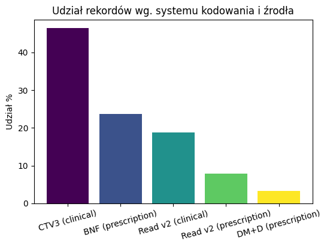
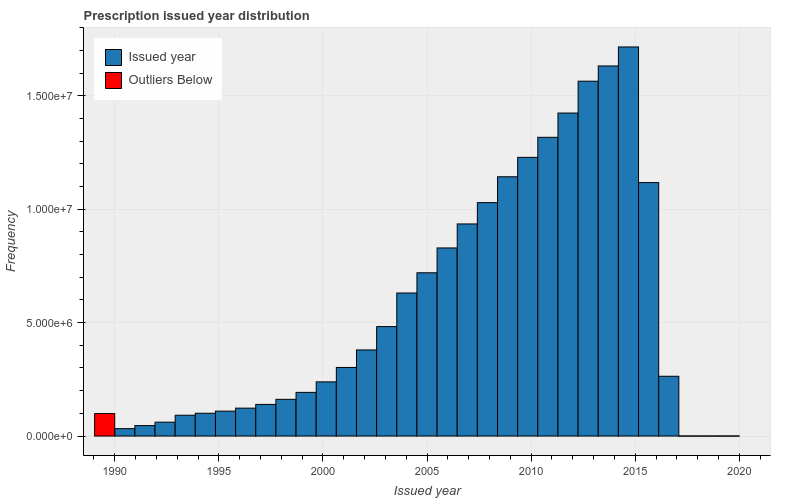
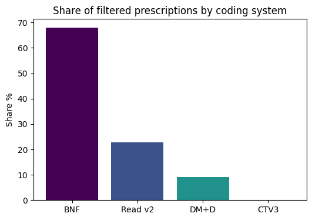
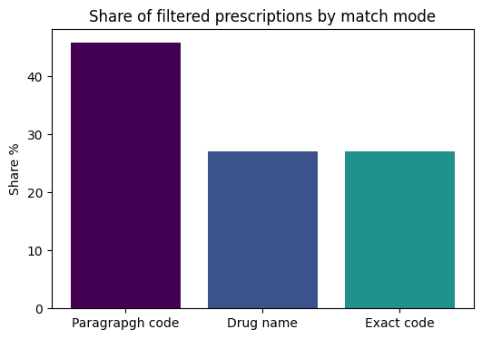
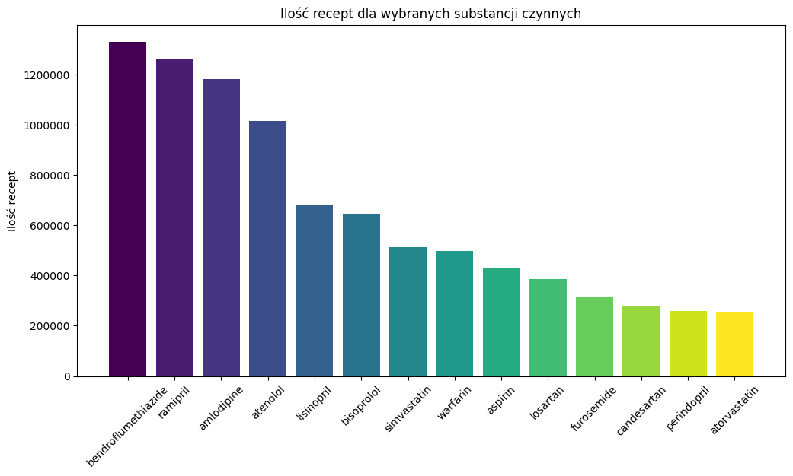
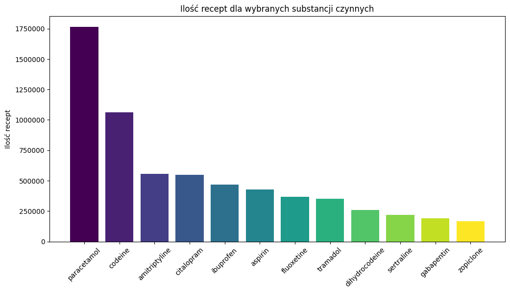

# Drug Response Phenotypes
> Current version 6.2.0.
> This document reflects version 4.0.0 !!

## Purpose
This tool was developed to extract, normalize, and filter prescription data from UK Biobank’s primary care records.

Prescription data in UK Biobank is vast and heterogeneous:
- It spans multiple decades and UK regions.
- It originates from different healthcare IT systems (TPP, EMIS, Vision).
- It uses diverse drug coding schemas (BNF, Read v2, CTV3, DM+D).
- It includes inconsistencies, missing fields, and free-text entries.

The tool tackles the challenge of transforming heterogeneous prescription records into structured, analyzable representations of patient exposure to active pharmaceutical ingredients (substances), enabling downstream use in pharmacogenomic analyses.

## Key Components

The tool is organized into two main components:

- **Code and brand name extraction** (`codes_extractor.py` module): 
Prepares mappings from substances to brand names and associated codes across drug classification systems (BNF, DM+D, Read2, CTV3). Implemented in the CodesExtractor class.
- **Prescription filtering and annotation** (`drugs_filtering.py` module): 
Uses the generated mappings to filter raw Hail-based prescription data and annotate records with active substances. Implemented in the DrugsFiltering class.

### Files generated
- `tokenized_brand_names.json` – substance to tokenized brand name dictionary
- `bnf_codes.json`, `dmd_codes.json`, `read2_codes.json`, `ctv3_codes.json` – code mappings per system
- Final filtered Hail table with schema: `eid`, `system`, `code`, `date`, `source`, `details`, `substances`, `tokenized_drug_name`.

## Processing Workflow

### Step 0: Substances (active pharmaceutical ingredients) list preparation

Before filtering prescriptions, a list of target substances and their alternative names was created.

The `extract_substances.ipynb` notebook was used to generate a normalized list of substances and synonyms from list of drugs (Nervous and Cardio-vascular systems) selected by our team. In cases of combination drugs, each individual substance was assigned all combination names as valid alternatives. 
Input file: `data/drugs_final.csv`  
Output file: `data/input/substances.json`

The `find_unlisted_substances.ipynb` notebook compared extracted substances list against the BNF lookup sheet (`data/ubk_lkps/bnf_lkp.csv`) from UK Biobank lookups, restricted to BNF groups starting with `02` (cardiovascular) and `04` (nervous system). This helped identify unmatched or ambiguous substances for review.  
Output: `excluded_substances.json`

### Step 1: Lookup Preparation with `CodesExtractor`

#### 1. Downloading and preparation of code lookups

Required lookup files are downloaded from UK Biobank's official repository and converted from Excel into structured CSV files. These include: BNF, DM+D, Read v2 and CTV3 lookups. This is handled automatically via `_ensure_files()` and `_download_files()` methods. 
Input file: `primarycare_codings.zip` (https://biobank.ndph.ox.ac.uk/ukb/ukb/auxdata/primarycare_codings.zip) 
Output files: `data/ukb_lkps/bnf_lkp.csv`, `data/ukb_lkps/dmd_lkp.csv`, `data/ukb_lkps/read_v2_drugs_lkp.csv`, `data/ukb_lkps/read_ctv3_lkp.csv`

#### 2. Generate substance to brand names dictionary
Using a user-provided dictionary of substances (active ingredients) and their alternative names, the `filter_brand_names()` method matches them against BNF descriptions in UKB BNF lookup (`BNF_Chemical_Substance` and `BNF_Product` columns). The matching is performed via tokenized and normalized strings comparison (checking whether an alternative name is present in the substance name field). Matched brand names are cleaned by removing substring duplicated and optionally refined via manually defined rules (manual_refinement_rules, with ignore and add options).

**Notice**: Substring filtering matches and removes names which are substring of other brand name in other substance entry. If applied – causes false negatives in prescription filtering. But without that filtering, results include false positives.

Input: `ukb_lkps/bnf_lkp.csv`, substances dictionary (i.e. `input/substances.json`), manual refinements list (i.e. `input/brand_names_refinement_rules`) 
Output file: `tokenized_brand_names.json`

#### 3. Generate substance to code dictionaries
The method `extract_codes(code_type)` loops through substances and their matched brand names, and searches the relevant lookup tables for matching descriptions.

It tokenizes description text and returns matched codes for each system (BNF, DMD, Read2, CTV3).

Input: lookups CSV files, brand names dictionary (`brand_names_dict` member var) 
Output files: `bnf_codes.json`, `dmd_codes.json`, `read2_codes.json`, `ctv3_codes.json`

> Execution of Step 1 is **typically about 3-4 minutes** with parallel processing of codes lookups (4 threads).

### Step 2: Prescription filtering with `DrugsFiltering`

This is the central logic of the tool, where raw prescriptions in a Hail Table are matched against known substance codes or tokenized drug brand names, then annotated with their corresponding substances (APIs).

#### Input data
- Hail Table of raw prescriptions data (clinical phenotypes table with primary care data) with columns: `eid`, `system`, `date`, `code`, `details` columns (`system`, `code`, `details` are mandatory)
- Tokenized brand name dictionary: `tokenized_brand_names.json`
- Codes dictionaries: `bnf_codes.json`, `dmd_codes.json`, `read2_codes.json`, `ctv3_codes.json`

#### Output data
- Filtered and annotated prescriptions data (in `filtered_prescriptions` attribute as Hail table), with the following added columns:
    - `tokenized_drug_name`: normalized details[0] field (lowercased, punctuation-stripped)
    - `substances`: list of matched substances
    - `match_mode`: matching method (one of: `'exact_code'`, `'paragraph_code'`, `'drug_name'`)
- Intermediate results from each sub-step – `bnf/read2/ctv3/dmd_code_prescriptions` and `drug_name_prescriptions` attribute.
- Matching statistics (`matching_stats` attribute) summarizing matched and unmatched records counts per system and method (and other stats).
- Unmatched records sets (`unmatched_prescriptions` attribute) from each sub-step for downstream inspection or further processing.

#### Key sub-steps:

#### 1. Input preparation (`prepare_input_data` method)
- Filters records to accepted coding systems (BNF, Read v3, CTV3, DM+D).
- Tokenizes prescription's drug name (`details[0]` field) using a regex-based Hail normalizer identical to `CodesExtractor._tokenize_drug_name`.

#### 2. BNF filtering (`filter_bnf_prescriptions` method):
- Two strategies are used: 
**Exact code filtering**: matches full 15-character BNF codes against dictionary ( `'exact_code'` match mode). 
**Paragraph-level filtering**: uses first 6 digits to identify drug categories. Applies additional filtering using lexical matches between `tokenized_drug_name` and known brand names for paragraph code. Paragraph-level filters are especially important due to large number of records where exact BNF code is absent (`'paragraph_code'` match mode).

#### 3. Read v2, CTV3 and DM+D filtering (`filter_..._prescriptions` methods)
- Matches full code using strict exact-code lookups from corresponding dictionaries
- Supports basic preprocessing (e.g., trimming .00 from Read2 codes)
- Annotates matched rows with substances and `'exact_code'` match mode.

#### 4. Drug name filtering for remaining record (`filter_unmatched_via_drug_name` method)
- For records not matched in 2nd and 3rd sub-step – not matched by any code from codes lookups.
- Matches `tokenized_drug_name` against brand names from lookups (as substring of brand name).
- Matched records are annotated with substances and `'drug_name'` match mode.

#### 5. Merging filtered subsets (`combine_prescriptions` method)
- All matched records from BNF, DMD, Read2, CTV3 and name-based filtering are merged via `.union()`
- Final filtered set is repartitioned, cached in memory and stored in `filtered_prescriptions`.

### Step 3: Dose and quantity annotation + cleaning

This step enriches filtered prescriptions with structured dose/quantity information and then performs quality cleaning before therapy splitting.

#### Input data
- Filtered prescriptions table (typically `filtered_prescriptions_v6.2.0.ht`) with text fields containing product name and quantity.
- Auxiliary CSV dictionaries for code-based fallback dose/quantity assignment (`bnf_doses_quantities.csv`, `dmd_doses_quantities.csv`, `read2_doses_quantities.csv`).

#### Output data
- Dose-annotated prescriptions table (typically `filtered_prescriptions_with_doses_v6.2.0.ht`) with normalized fields:
    - `dose` (selected unit + values),
    - `quantity` (`value` and `is_days`).
- Cleaned table for therapy splitting (typically `cleaned_prescriptions_with_doses_v6.2.0.ht`) after outlier removal and missing-value handling.

#### Key sub-steps:

#### 1. Text normalization and regex extraction (`DoseAnnotation`)
- Normalizes drug text (`drug_name`, `quantity`) including unit harmonization (`g`, `mg`, `mcg`, `ml`, `%`, `unit`) and quantity patterns (e.g., packs, multiplications, week/month conversions).
- Extracts dose candidates and quantity candidates using regex-based parsers.

#### 2. Annotation from description (`annotate_based_on_description`)
- Builds pair-level lookups from `(drug_name, quantity)` to extracted arrays.
- Annotates rows with `doses` and `quantities` arrays from free-text content.

#### 3. Fallback annotation from code dictionaries (`annotate_based_on_code`)
- For still-unannotated rows, fills doses/quantities from system-specific lookup CSVs using `matched_code` (`bnf`, `dmd`, `read_2`).

#### 4. Canonical dose/quantity projection (`split_quantity_and_dose_columns`)
- Converts extracted arrays into final structured columns:
    - `dose = {unit, values}`,
    - `quantity = {is_days, value}`.

#### 5. Data quality cleaning (`DataCleaning.clean_data`)
- Removes non-positive dose/quantity values.
- Removes extreme outliers with per-substance statistics (`mean + N*SD`) and absolute quantity threshold.
- Optionally imputes missing dose/quantity by group-wise mode (only if mode frequency >=50%).
- Drops unresolved missing records to ensure downstream consistency.

### Step 4: Therapy splitting (`TherapiesSplitter`)

This step groups cleaned prescriptions into therapy episodes (`tid`) using temporal continuity and optional dose-shift detection.

#### Input data
- Cleaned prescriptions with dose/quantity/date fields (typically `cleaned_prescriptions_with_doses_v6.2.0.ht`).
- Parameters:
    - `time_gap_days` (default `60`),
    - `window_size` (default `5`),
    - `sd_fraction` (default `2.0`).

#### Output data
- Therapy-split table (typically `cleaned_prescriptions_splited_to_therapies_v6.2.0.ht`) with therapy identifiers:
    - final `tid` per therapy episode,
    - `daily_dose` calculated from dose/quantity/interval,
    - preserved prescription-level context for phenotype generation.

#### Key sub-steps:

#### 1. Temporal preprocessing (`_prepare_data`)
- Orders records by patient/substance/date.
- Computes inter-prescription intervals.
- Creates preliminary therapy boundaries with gap rule:
    - new therapy if `prev_interval > prev_quantity + time_gap_days`.

#### 2. Daily dose derivation (`_calculate_daily_doses`)
- Calculates `daily_dose = dose * quantity / interval` for each record where values are defined.

#### 3. Optional statistical split refinement (`split`)
- Inside initial therapies, merges very close records (<14 days) for stability.
- Detects potential change points from rolling medians of `daily_dose`.
- Verifies dose-shift candidates with Welch t-test (`p < 0.05`).
- Applies confirmed split points and rebuilds final consistent therapy IDs.

#### 4. Finalization
- Rekeys rows by final `tid`.
- Returns a table ready for downstream phenotypes (`duration`, `PDC`, dose trajectories, change-of-drug analyses).

#### Safety checks
- All filtering steps are decorated with `@_track_step_execution`, which logs: Start/end timestamps, execution time, exception tracebacks and message summaries.
- In case of unrecoverable error (logic not able to proceed further) the error is logged and an exception is thrown (`PrescriptionProcessingError`).

> Step 2 with 189M input records and 359 substances to filter on 8xCPU UKB instance (JupyterLab 2.3.1) completed **in exactly 3 hours** and 31.6M prescriptions were obtained. The majority of execution time (90%) is spent on drug name–based filtering, so performance may be improved with a reduced brand name list.

> *Valid for 3.0.0 version, left as trivia*: Execution time may be amazingly short at this point when filtering is run on properly configured environment. For example – older JupyterLab 2.3.1 app (UKB RAP platform) with Hail 0.2.116 and Spark 3.2.3, instance 4xCPU – the execution of whole Step 2 with 189M input records and 359 substances to filter took only 12 minutes! But for newer (2.4.1) JupyterLab app the execution time was enormous – 4h 30min (sic!). So better stick with older one. ;)

## Data Insights

### Input data (general practice records)
The input dataset comprises approximately **189 million records** sourced from UK Biobank’s general practice data release. The dataset was created from GP prescriptions, GP registrations, clinical events and hospitalizations. These originate from the following Spark/Hive tables dispensed by UK Biobank: `gp_scripts`, `gp_registrations`, `gp_clinical`. Among them, **181.3 million records** are considered as related to drug usage and serve as the starting point for filtering.

The unified input Hail table (clinical phenotypes with primary care data) was constructed from multiple Spark/Hive tables dispensed by UK Biobank  using the notebook `drug-diagnosis-database-construction.ipynb` (https://github.com/ippas/ifpan-abm-pgxpred/blob/master/preprocessing/pheno/drug-diagnosis-database-construction.ipynb). This step harmonized the raw data into a single structure for downstream processing.

Current location of input dataset is `clinical_phenos` database and `full_phenos_hail_0.2.116.ht` Hail table.

 
**Fig 1. Share of coding system and data sources in raw general practice dataset.**

 
**Fig 2. Prescription issued year distribution across dataset.**

### Prescriptions coding systems and input data exploration

At first glance, prescription coding systems in UK general practice data may seem straightforward – but the deeper you go down the rabbit hole, the harder (and more complicated) it gets.

UK Biobank provides reference materials to help navigate this:
- `primary_care_data.pdf` –  Guidebook describing the structure, coding systems, and data quality aspects of the primary care records in the UKB dataset. 
https://biobank.ndph.ox.ac.uk/showcase/showcase/docs/primary_care_data.pdf
- `primarycare_codings.zip` – Official lookup tables for drug coding systems (BNF, Read v2, CTV3, DM+D), including mappings between them. These are used for code and brand name extraction in our workflow. A detailed PDF description is included in the zip file. 
https://biobank.ndph.ox.ac.uk/ukb/ukb/auxdata/primarycare_codings.zip

We have also conducted data-driven exploration of primary care records and UKB lookup tables. Results with examples, charts and summaries are available in the link following. Below detailed index.
 
https://github.com/ippas/ifpan-abm-pgxpred/tree/master/preprocessing/pheno/drug-response-phenotypes/scripts/data_exploration

- Analysis of particular code formats, lengths, and hierarchy (structure) based on raw GP data:
    - `bnf_codes_structure.ipynb` – BNF codes (main source of brand names)
    - `read2_codes_structure.ipynb` – Read v2 codes in clinical and prescriptions data
    - `read2_codes_structure_prescriptions_only.ipynb` – Read v2 codes only in prescriptions data
    - `ctv3_codes_structure.ipynb` – CTV3 codes (Read v3)
    - `dmd_codes_structure.ipynb` – DM+D codes
- `drug_name_special_characters_pheno_data.ipynb` – Summary of problematic characters and formatting issues in drug name fields in GP data.
- `biobank_lookups_special_characters.ipynb` – Examination of special characters and inconsistencies in names/descriptions in UKB lookup files.

### Output data (filtered prescriptions)

Our objective was to isolate prescriptions belonging to two therapeutic categories of interest:
- **Cardiovascular System** (BNF Chapter 2)
- **Central Nervous System** (BNF Chapter 4)

We selected 359 active pharmaceutical ingredients (substances) as base for filtering. From the original 181.3 million medication-related records, the tool successfully extracted and annotated 31.6 million prescriptions that matched the target substance groups.

Current location of filtered prescriptions dataset is `clinical_phenos` database and `filtered_prescriptions_v4.0.0.ht` Hail table.

 
**Fig 3. Share of prescriptions coding system in filtered data.**

 
**Fig 4. Share of prescriptions matching mode in filtered data.**

***TODO: Update figure 5. and figure 6. to current 4.0.0 version. Below 3.0.0 version data charts.***

 
**Fig 5. Top 14 most frequently prescribed substances – cardiovascular system.**

 
**Fig 6. Top 12 most frequently prescribed substances – central nervous system.**

### Statistics of data based on v6.2.0

This section extends the documentation with details extracted from scripts/notebooks located in the parent folder (`preprocessing/pheno`) and from the current v6.x processing notebooks.

#### A. Prescription database

- full input table: **56,183,932** rows,
- all matched records: **28,360,702**,
- all not matched records: **27,823,230**,
- matched by Read2 code: **7,263,942**,
- matched by BNF code: **1,145,283**,
- matched by DM+D code: **5,408**,
- matched by drug-name fallback: **19,946,069**.

Final output written to:

- `prescriptions_db/filtered_prescriptions_v6.2.0.ht` (**28,360,702** rows).

#### B. Dose/quantity annotation
- doses from text description: **24,339,744** records (**85.82%**),
- quantities from text description: **24,339,744** records (**85.82%**),
- total with dose assigned (after code fallback): **24,346,933** (**85.85%**),
- total with quantity assigned (after code fallback): **24,226,182** (**85.42%**),
- final written table: **25,634,325** rows.

#### C. Therapy split
- **24,799,457** rows (num of therapies)

#### D. Downstream phenotype table sizes (`num_pf_rows` = `num_of_samples`) 

From `scripts/phenotypes_generation/notebooks`:

- `basic_prescription_phenotypes_v6.2.0.ht`: **221,889** rows,
- `count_phenotypes_substance_v6_2_0.ht`: **175,268** rows,
- `count_phenotypes_section_v6_2_0.ht`: **175,268** rows,
- `doses_values_phenotypes_v6_2_0.ht`: **175,259** rows,
- `doses_peaks_phenotypes_v6_2_0.ht`: **175,259** rows,
- `longest_therapy_duration_phenotypes_v6_2_0.ht`: **175,268** rows,
- `pdc_v6_2_0.ht`: **175,266** rows,
- `change_to_another_drug_from_bnf_section_phenotypes_v6_2_0.ht`: **175,268** rows.

## Limitations and Challenges

The prescription data processed by this tool come from UK Biobank’s general practice records, which were originally **collected for administrative — not research — purposes**. As such, the data present several inherent limitations:

- **Inconsistent data quality**: The accuracy and completeness of entries vary significantly across providers and time. Many records are incomplete, misformatted or simply incorrect.
- **Lack of standardization in text fields**: Product names are often entered as free-form strings, without adherence to any controlled vocabulary. This results in inconsistent casing, abbreviations, spelling variants, and inclusion of dosage forms.
- **Partial data availability**: The dataset covers only ~45% of the UK Biobank cohort and varies in coverage depending on region and provider system.
- **Ambiguity in clinical meaning**: The mere presence of a prescription record does not confirm actual drug intake, nor adherence.

## Versions History (changelog)

> We are trying to adopt Semantic Versions (SemVer) in the tool development.

#### 1.0.0
- Initial implementation adapted from the earlier wgsdepresja project.
- Filtering logic refactored from a Jupyter Notebook into reusable Python class.
- Used CSV-based drug code dictionaries specific to MDD (major depressive disorder) to identify prescriptions.
- Input column `info` used for matching brand names.

#### 2.0.0
- Introduced updated input schema: replaced `info` column with `details`, reflecting changes in the Hail table structure.
- Implemented step execution tracking with logging and timing decorators for improved diagnostics.

#### 3.0.0
- Complete redesign of the filtering strategy.
- Moved away from static code CSVs to dynamic dictionary generation based on substances list.
- Code and brand name dictionaries are constructed from UK Biobank-provided lookup tables.
- Tokenization of both brand names and prescription text.
- Substance-level annotation of filtered prescriptions.
- Filtering results include an explicit `substances` field listing matched active pharmaceutical ingredients per record.

#### 3.0.1
- Substring-based brand name filtering added during dictionary building to reduce false-positive substance matches in prescriptions (applies false-negative approach).

#### 3.1.0
- Enhanced drug name tokenization logic for better normalization and matching.
- Codes and brand names process extraction refactored (faster and cleaner).

#### 3.2.0
- Support for manual regex-based refinement rules (add/ignore) in brand name extraction step.

#### 4.0.0
- Drug name–based matching implemented for prescriptions not matched by code (yielding a 55.6% increase in matched records overall).
- Major refactor of `DrugsFiltering` class.
- Unified token normalization in prescription annotations with `CodesExtractor` tokenization.
- Prescriptions matching statistics including detailed counts for matched and unmatched records at each step of pipeline.
- Intermediate unmatched prescriptions sets made available for downstream inspection or custom post-processing.